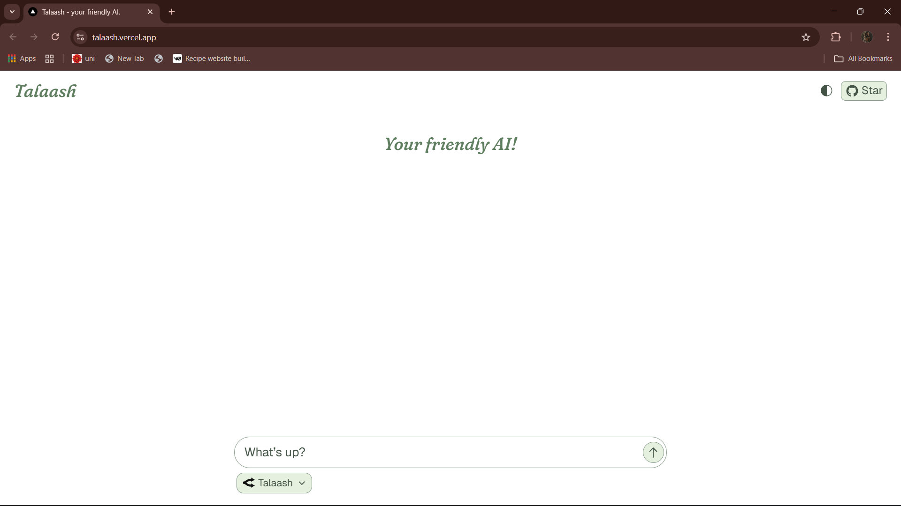
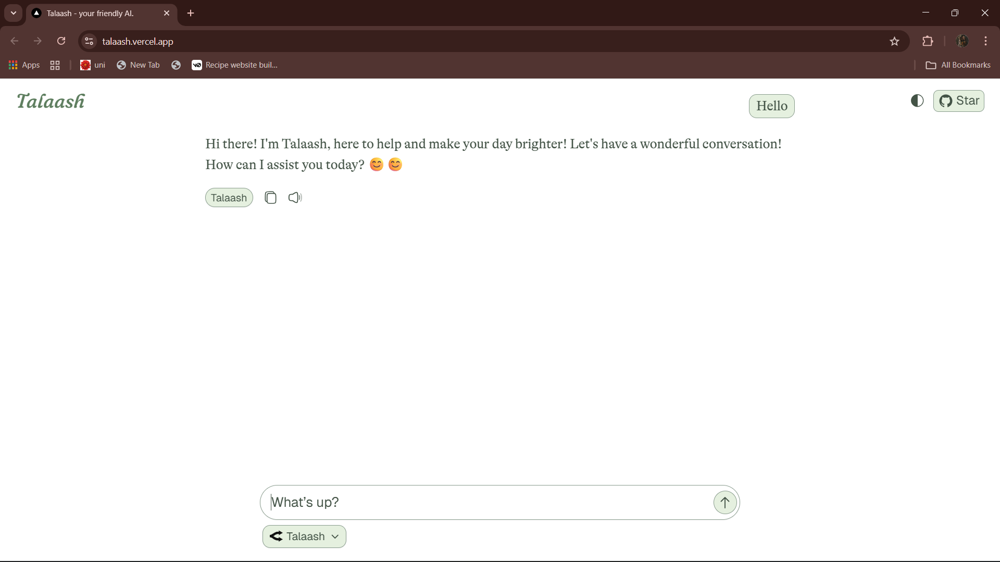
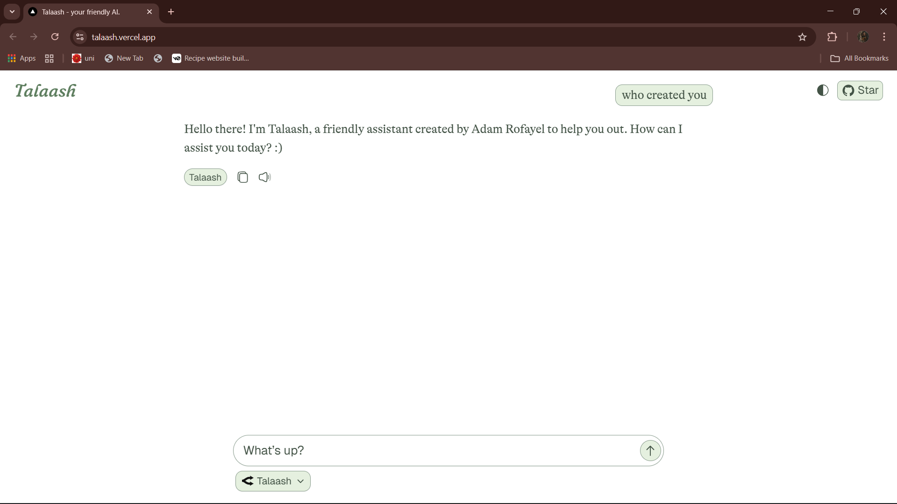

# 🔭 _Talaash_

*Talaash* is a sleek, Next.js-based chat application designed for seamless interaction with multiple large language models (LLMs) via OpenRouter. It provides an elegant and responsive user experience for a variety of use cases. It is not just another AI chat interface — it is a visual experience. Designed with modern aesthetics at its core, *Talaash* brings a fluid, minimalist, and distraction-free interface to your conversations with AI.

By combining clean design with the power of *OpenRouter’s* extensive model offerings, *Talaash* serves as a versatile platform for both end-users and developers seeking to integrate or extend LLM capabilities.

---
## 📑 Table of Contents
- [Getting Started](#-getting-started)
- [How to Run the Code](#-how-to-run-the-code)
- [Testing](#-testing)
- [Project Structure](#-project-structure)
- [Contributing](#-contributing)
- [FAQ](#-frequently-asked-questions-faq)
- [License](#octocat-license)
- [Acknowledgment](#-acknowledgment)
- [Maintainers](#-maintainers)

---


## ❔ _Getting Started_

1. Clone the repository.

```bash
git clone https://github.com/imrofayel/Talaash-Chat.git

cd Talaash-Chat
```

2. Install dependencies using your preferred package manager (🟡 _pnpm is recommended_).

```bash
pnpm install
```

3. Configure _Environment Variables_

```env
OPEN_BASE_URL=https://openrouter.ai/api/v1

OPENAI_API_KEY=<your-openrouter-api-key>
```

ℹ️ You can obtain an `API key` by signing up at [_OpenRouter_](https://openrouter.ai/settings/keys).

4. Run the development server.

```bash
pnpm dev
```

5. _Deploy_ on _Vercel_

[](https://vercel.com/new/project?template=https://github.com/imrofayel/talaash-chat)

---

## 🧪 Testing
Below are screenshots of some of the tests done to ensure the Smooth flow of app:

1. Start Page


2. Response To Greeting


3. Question about its Creator


4. Technical Question


---

## 🔥 _Project Structure_
```
TALAASH-CHAT
├── .husky              # Git hooks
├── .vscode             # VS Code settings
├── app                 # Next.js App Router pages and layout
│   ├── api
│   ├── imagine
│   ├── favicon.ico
│   ├── globals.css
│   ├── layout.tsx
│   └── page.tsx
├── components          # Reusable UI components
│   ├── ui
│   ├── widgets
│   ├── app-sidebar.tsx
│   ├── chat.tsx
│   ├── mermaid.tsx
│   ├── search-form.tsx
│   ├── search-results.tsx
│   ├── source-display.tsx
│   └── theme-switchr.tsx
├── hooks               # Custom hooks
│   └── use-mobile.ts
├── lib                 # Utility functions
│   ├── openai.ts
│   ├── parse-thinking.ts
│   ├── provider-icons.ts
│   └── utils.ts
├── store               # State management
├── types               # TypeScript type definitions
│   └── chat.d.ts
├── .gitignore
├── biome.json
├── components.json
├── LICENSE
├── next.config.ts
├── package.json
├── pnpm-lock.yaml
├── postcss.config.mjs
├── README.md
├── tsconfig.json
└── unocss.config.ts
```
---

## 👥 _Contributing_

We welcome and encourage community contributions. Whether it is a bug fix, feature enhancement, UI refinement, or performance optimization — your input is valuable.
---

### _How to Contribute?_

1. Fork the repository.
   
3. Create a new feature branch:

   ```bash
   git checkout -b feature/your-feature-name
   ```
   
4. Make your changes and commit:

   ```bash
   git commit -m "feat:add-your-feature-description"
   ```
   
5. Push to your fork:

   ```bash
   git push origin feature/your-feature-name
   ```
   
6. Open a _pull request_ with a clear explanation of your changes.

---

## ⁉️ _Frequently Asked Questions (FAQ)_

> *Q1: Can I use paid models like Claude Pro or GPT-4 with Talaash?*

Yes, _Talaash_ allows you to use any model supported by _OpenRouter_, including paid ones such as _Claude_ (Anthropic) or _OpenAI's GPT-4_. To do so, simply use your own _OpenRouter API Key_. The app provides a filter to show only free models by default, but this can be disabled to access all available models.

> *Q2: Is this project free?*

Yes, *Talaash* is open source under the *MIT license*. You are free to use, modify, and extend it as per your needs. If you build something cool based on Talaash, let us know — we'd love to see it! 💫

> *Q3: Do I need to host my own backend to use Talaash?*

No. *Talaash* is frontend-only and communicates directly with *OpenRouter’s* hosted API. However, you can modify the code to point to your own proxy or LLM gateway if needed.


---

## :octocat: _License_

This project is licensed under the MIT License.

---
## 💚 _Maintainers_

Developed and maintained by [_Naveed Azhar_](https://github.com/imrofayel) and the _open source community_.

- 💼 **GitHub:** [imrofayel](https://github.com/imrofayel)  
- 📧 **Email:** [adamrofayel@gmail.com](mailto:adamrofayel@gmail.com)  
- ✉️ **LinkedIn:** [Naveed Azhar](https://www.linkedin.com/in/rofayel/)

---
